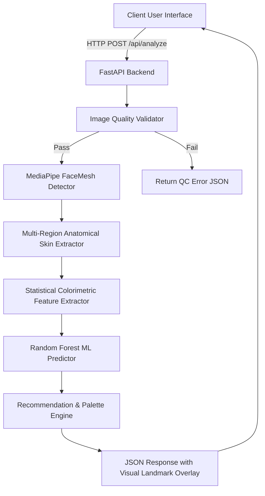

# Phase 1: Requirements Analysis, Literature Review & Architecture Design
### Timeline: Weeks 1 to 4 | Otterlook AI

---

## 1. Problem Identification & Motivation
Personal color analysis (seasonal color draping) determines the harmonious palette of clothing, cosmetics, and jewelry for an individual based on their skin undertone. 

### Limitations of Existing Approaches:
1. **Manual In-Person Consultations:** Subjective, costly ($150–$300/session), and heavily influenced by room ambient lighting (fluorescent vs. incandescent) and consultant bias.
2. **Naive Digital Apps:** Sample a single arbitrary pixel (or average bounding box) in RGB color space. They fail to isolate skin from hair/shadows and conflate **surface pigmentation (melanin)** with **subdermal undertones (vascular erythema & carotenoids)**.
3. **Ethnic Bias:** RGB thresholding disproportionately misclassifies Fitzpatrick skin types IV–VI as warm simply due to higher melanin density.

---

## 2. Literature Review & Theoretical Foundations

### 2.1 Dermatological Skin Optical Properties
Human skin reflectance is modeled by two primary chromophores:
1. **Melanin:** Located in the epidermis; determines overall lightness and brown/black pigmentation ($L^*$).
2. **Hemoglobin (Oxygenated / Deoxygenated):** Located in dermal blood capillaries; creates red/pink flushing ($a^*$).
3. **Bilirubin & Carotenoids:** Subdermal yellow pigmentation ($b^*$).

### 2.2 CIELAB ($L^*a^*b^*$) Color Space
The standard CIE $L^*a^*b^*$ color space matches human perceptual uniformity:
- **$L^*$:** Perceptual Luminance ($0 = \text{Black}, 100 = \text{Diffuse White}$).
- **$a^*$:** Green–Red axis (negative = green, positive = red/erythema).
- **$b^*$:** Blue–Yellow axis (negative = cool blue, positive = warm yellow).

### 2.3 Individual Typology Angle ($\text{ITA}^\circ$)
Standardized dermatological metric for skin phototype classification:
$$\text{ITA}^\circ = \frac{\arctan\left(\frac{L^* - 50}{b^*}\right) \times 180}{\pi}$$

| $\text{ITA}^\circ$ Range | Classification | Fitzpatrick Equivalent |
|---|---|---|
| $> 55^\circ$ | Very Light | Type I |
| $41^\circ \text{ to } 55^\circ$ | Light | Type II |
| $28^\circ \text{ to } 41^\circ$ | Intermediate | Type III |
| $10^\circ \text{ to } 28^\circ$ | Tan | Type IV |
| $-30^\circ \text{ to } 10^\circ$ | Brown | Type V |
| $< -30^\circ$ | Dark | Type VI |

---

## 3. System Requirements Specification (SRS)

### 3.1 Functional Requirements (FR)
- **FR-1 [Quality Check]:** Inspect image for resolution ($\ge 200\times200\text{px}$), blur (Laplacian variance $\sigma^2 \ge 50$), and exposure ($40 \le \mu \le 220$).
- **FR-2 [Face & Landmark Detection]:** Detect face and localize 468 MediaPipe landmarks.
- **FR-3 [Anatomical Segmentation]:** Isolate 4 distinct anatomical patches (Forehead, Left Cheek, Right Cheek, Jaw/Chin) while eliminating lips, eyes, eyebrows, shadows, and hair.
- **FR-4 [Feature Extraction]:** Extract 18 statistical moments across sRGB, HSV, CIELAB ($L^*a^*b^*$), and $\text{ITA}^\circ$.
- **FR-5 [ML Classification]:** Predict skin undertone (**Warm**, **Cool**, **Neutral**) with probabilistic confidence scores.
- **FR-6 [Recommendation Generation]:** Output curated wardrobe, cosmetics, accessories, neutral basics, and seasonal harmony.

### 3.2 Non-Functional Requirements (NFR)
- **NFR-1 [Latency]:** Total end-to-end processing under 300 ms on standard CPU hardware.
- **NFR-2 [Privacy & Security]:** Zero persistent storage of facial biometric data; processed purely in-memory.
- **NFR-3 [Compatibility]:** Responsive cross-platform web interface (Desktop, Tablet, Mobile).

---

## 4. System Architecture

